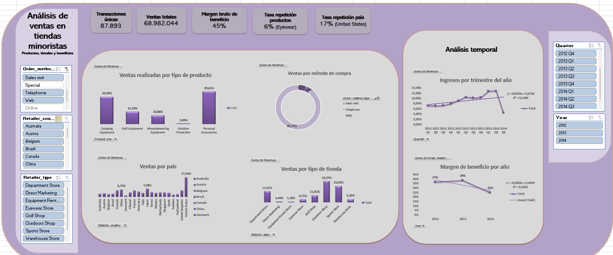
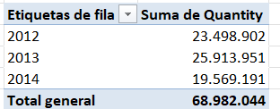
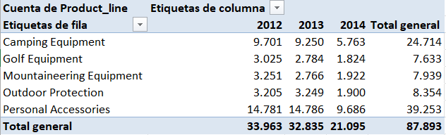
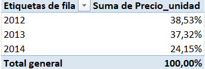
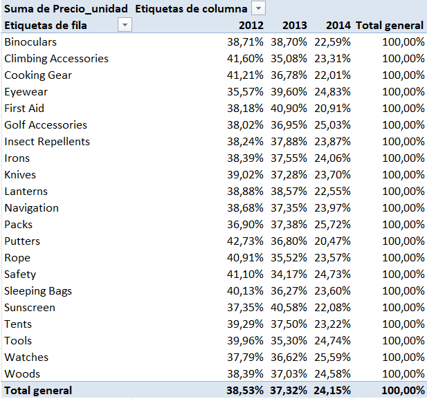

# 🔎Análisis interactivo de ventas: Exploración y Control de rendimiento de ventas
 
**📃Descripción del proyecto**

Este proyecto realiza un análisis exploratorio y descriptivo sobre las ventas de diferentes tiendas minoristas ubicadas en distintos países. El objetivo principal del proyecto es identificar tendencias, patrones y realizar un análisis descriptivo que nos proporcione una imagen clara sobre lo que ha pasado con las ventas de estas tiendas minoristas. Para ello, se han utilizado herramientas como gráficas de barras, tablas de frecuencia, medidas de tendencia central (moda, media, mediana) y gráficos de líneas para ver la tendencia en el tiempo.
 
**🗼Estructura del proyecto**
 

        ├── Dashboard/            # Gráficos y archivos de resultados
        ├── README.md             # Descripción y presentación del proyecto
        ├── VentasProductos_Data  # Archivo con todos los datos y resultados
        ├── Análisis interactivo de ventas  # Presentación power point
        
        
**👩‍💻Instalación y Requisitos**
 
Este proyecto usa la versión de Excel 2410 y requiere de las siguientes herramientas:
 
- Power Query
- Herramientas de análisis de datos
- Funciones
- Gráficas
 
**🤓Resultados y Conclusiones**

Los principales hallazgos encontrados en el presente proyecto son:

- La línea de productos donde las tiendas minoristas venden más artículos es Personal Accesories (representa un 39,61% de las ventas totales), que se refiere a una serie de productos relacionados con los accesorios personales. Dentro de esta línea de producto se encuentran (Binoculars, Eyewear, Knives, Navigation, Watches). Luego, la segunda línea de productos donde se venden más artículos es Camping Equipment (representa un 33,30% de las ventas totales), y dentro de esta línea de producto se encuentran (Cooking Gear, Packs, Lanterns, Sleeping Bags y Tents).

- El método de compra más utilizado por los clientes es a través de la Web de la tienda minorista, representando un 89,71% de las ventas totales.

- Las tiendas minoristas que efectúan más ventas se encuentran en Estados Unidos, representado un 17% de las ventas totales. 

- El tipo de tienda que realiza más ventas es Outdoors Sports, representando un 33,37% de las ventas totales. 

- En cuanto a los ingresos totales generados por las tiendas minoristas, los trimestres del año donde se obtuvieron un mayor % de ingresos fueron en los trimestres 1 y 2 del año 2024 (Enero, Febrero, Marzo, Abril, Mayo y Junio). A partir de este periodo de tiempo, los ingresos empezaron a decrecer y en este conjunto de datos ya no se tiene información sobre los datos del trimestre 4 en el año 2014. La ecuación de la recta y = 0,0029x + 0,0736 nos indica que, por cada trimestre del año que pasa, los ingresos obtenidos en las tiendas aumenta en un 0,2%. 

- Por último, el márgen de beneficio por año es mayor en 2012 (37%) y en 2013 (39%). En el año 2014 se pasa a tener un 25% de margen bruto de beneficio. Por tanto, la ecuación de la recta y= -0,0583x + 0,4499 se puede interpretar que, por cada año que pasa, el márgen de beneficio obtenido por las tiendas minoristas disminuyen en un 5%. Sin embargo, el R2 representa un 0,63% de la variabilidad del margen de beneficio por año, por lo que el porcentaje restante está explicado por otros factores que no controlamos. 
 

 

Este análisis sugiere que las tiendas minoristas empezaron a reducir sus beneficios, tal y como sugieren los datos del Dashboard. Las principales causas a las que se puede deber este fenómeno son:
 
- Bajaron los volúmenes de ventas en el año 2014 respecto a los años anteriores.
 
  

- Las ventas por línea de producto han reducido su volumen en el año 2014 vs los años anteriores.
 
    

- Los precios por unidad bajaron en 2014 vs los años anteriores, lo que puede indicar una señal de promociones o descuentos que no se han tenido en cuenta en este conjunto de datos.
 
  

- La mayoría de los productos tuvieron precios unitarios más bajos en 2014 vs los años anteriores.
 
  

Para poder explicar por qué bajan los volumenes de ventas, el margen de beneficio y el precio por unidad, nos faltan datos para dar conexto a esta situación. Por ello, se deben tener en cuenta factores sociológicos como:

- Con la transformación digital, la proliferación de información y comparadores de precios en línea puede haber empoderado a los consumidores para buscar las opciones más económicas, presionando a la baja los precios (el método de compra más usado en estas tiendas es a través de la web).
 
- El auge del comercio electrónico pudo haber creado una dinámica de precios más competitiva, donde los consumidores esperan precios más bajos.

- Si la empresa no optimizó suficientemente su estrategia digital, pudo haber perdido oportunidades para mantener márgenes saludables.
 
- Los consumidores son un perfil ligado al deporte, por lo que entre sus preferencias puede estar el hecho de que quieran comprar los artículos en la tienda física en vez de online.

 
**👉Próximos pasos**
 
Para mejorar este proyecto, algunas de las cosas que se podrían hacer para mejorar el negocio son:
 
- Las tiendas minoristas podrían revisar los costos logísticos y de producción para identificar ineficiencias.

- Se podrían realizar análisis trimestrales para monitorear la contribución de cada línea de producto al margen total.

- Establecer un sistema de monitoreo de KPIs clave, como márgenes de producto y país, así se podrían identificar rápidamente las tendencias negativas en tiempo real.
 
Por otra parte, lo que se podría hacer para mejorar el proyecto es:
 
- Se carece de información sobre el trimestre 4 del año 2014. Habría estado bien obtener información sobre ese trimestre para ver por qué las tiendas minoristas toman la decisión de no vender más sus artículos al mercado, ya que parece una decisión muy drástica porque en el trimestre 3 del 2014 no se han observado pérdidas en las tiendas. 

**✍️Contribuciones**
 
Las contribuciones son bienvenidas. Si deseas mejorar el proyecto, por favor abre un push request o una issue.
 
**🗯️Autores y Agradecimientos**
 
**Claudia Soler** - [@clausoler](https://github.com/clausoler/Proyecto1-DashboardExcel)
 
